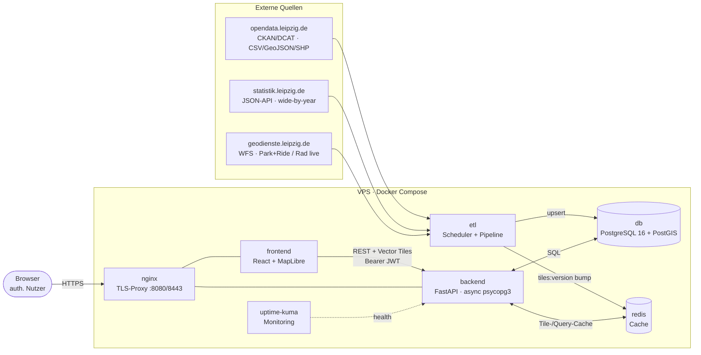
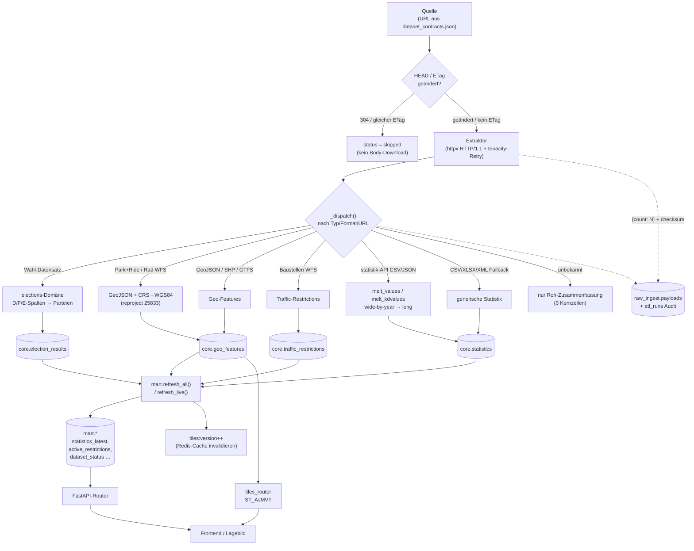
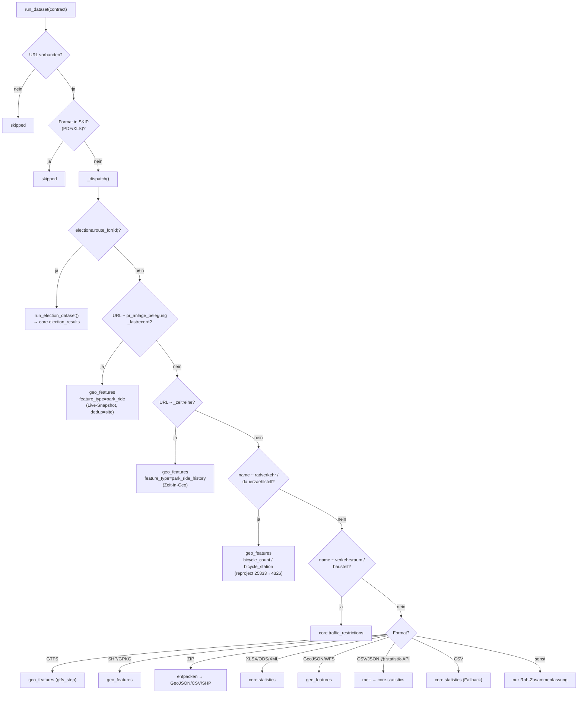
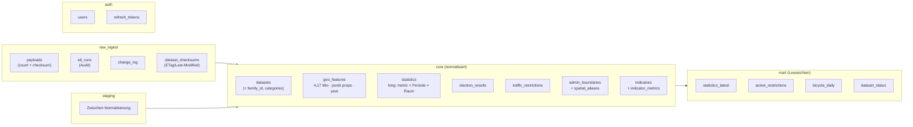
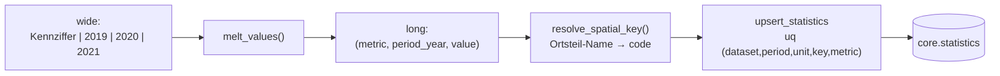
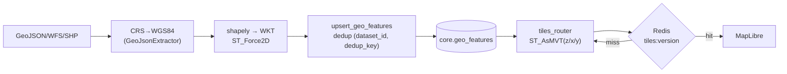
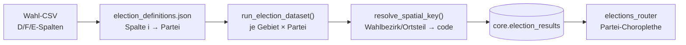
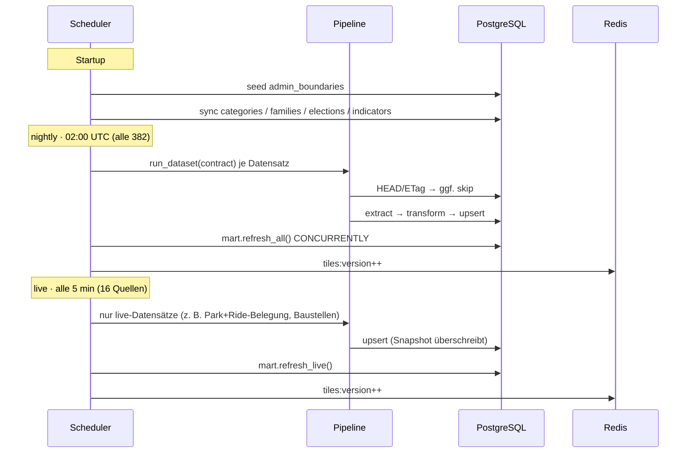
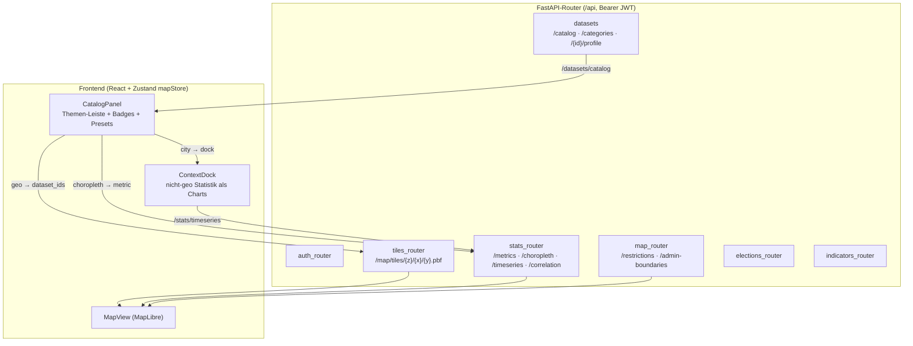

# Architektur & Datenverarbeitung

> Wie Daten von `opendata.leipzig.de` / `statistik.leipzig.de` bis ins Lagebild
> fließen — Dienste, Pipeline, Speicherschichten, Verarbeitung. Diagramme sind
> Mermaid (rendern auf GitHub und in den meisten Markdown-Viewern).
> Stand: 2026-06. Ergänzt `datensatz-analyse.md` (Inhalt der Datensätze).

---

## 1. Systemüberblick

Ein VPS (4 GB RAM), alle Dienste in Docker Compose hinter einem TLS-Nginx.

| Dienst | Port | Rolle |
|--------|------|-------|
| `db` | 5432 | PostgreSQL 16 + PostGIS 3.4 — alle 5 Schemata |
| `redis` | 6379 | Tile-Cache + Query-Cache, invalidiert via `tiles:version` |
| `backend` | 8000 | FastAPI, JWT-Auth, MVT-Tiles, Statistik-Endpunkte |
| `etl` | — | APScheduler: nightly 02:00 UTC + live alle 5 min |
| `frontend` | 80 | Vite-Build, MapLibre-Lagebild |
| `nginx` | 8080/8443 | TLS-Terminierung, Reverse-Proxy |
| `uptime-kuma` | 3001 | Verfügbarkeits-Monitoring |

---

## 2. Datenfluss end-to-end

Der rote Faden: **Extraktion → Roh-Audit → typ-spezifische Transformation →
Upsert in Kerntabellen → materialisierte Sichten → API → Karte.**

**Wichtig zur Roh-Schicht:** `raw_ingest.payloads` speichert nur eine
`{"count": N}`-Zusammenfassung + Checksumme zur Änderungserkennung — **nicht**
die Rohdaten. Extrahierte Daten fließen direkt Extraktor → Loader → Core. Ein
ungeladener Datensatz muss daher aus der Quelle neu geholt werden.

---

## 3. Dispatch-Entscheidungsbaum (`etl/src/pipeline.py`)

Die Reihenfolge ist bewusst: **kuratierte semantische Domänen schlagen
Format-Heuristiken.** Erster Treffer gewinnt.

---

## 4. Speicherschichten (5 Schemata)

Die **Verarbeitungsschritte** je Schema:

1. **`raw_ingest`** — Änderungserkennung (ETag/Last-Modified → 304-Skip), Lauf-Audit,
   Checksummen. Quelle der Wahrheit für „lief, mit welchem Status".
2. **`staging`** — leichte Zwischen-Normalisierung (bei Bedarf).
3. **`core`** — die normalisierten Domänentabellen. Räumliche Schlüssel werden über
   `core.resolve_spatial_key()` aus `spatial_aliases` zum kanonischen `spatial_code`
   aufgelöst (Join-Basis für Choroplethen).
4. **`mart`** — `CONCURRENTLY` refreshte materialisierte Sichten für schnelle Reads.
5. **`auth`** — Nutzer + gehashte Refresh-Tokens.

---

## 5. Drei Verarbeitungspfade im Detail

### 5a. Statistik-Melt (statistik.leipzig.de)
Die API liefert **wide-by-year** (Kennziffer × Jahr/Quartal/Schuljahr) bzw.
**kdvalues** (Gebiet × Sachmerkmal). `statistik_transform.py` schmilzt sie in
Long-Records, bevor `upsert_statistics` schreibt.

### 5b. Vereinheitlichter Geo-Layer + Vector Tiles
Alle Geo-Quellen liegen in **einer** Tabelle; der MVT-Layer rendert sie
zoomabhängig (Cluster → Einzelpunkte). Park+Ride/Rad wurden hierher umgeleitet.

### 5c. Wahl-Domäne (Offene Wahldaten)
Spaltenstandard A/B/C/D/E/F + `D{i}`/`F{i}` je Partei in amtlicher Reihenfolge;
Partei-Mapping aus `election_definitions.json` (verifiziert gegen die Named-Shares
der statistik-API).

---

## 6. Scheduling: nightly vs. live

**Fachlich wirklich live:** Park+Ride-Belegung (minütlich relevant),
Verkehrseinschränkungen. Radzählungen sind tagesaktuell. Übrige als „live"
markierte Quellen sind statisch/jährlich und gehören in den nightly-Takt.

---

## 7. Backend-API → Lagebild

### `/datasets/catalog` — der Knoten der neuen UI
Ein Pass über alle vier Stores liefert je logischem Datensatz (Familien
kollabiert), **welche Darstellungen** er trägt:

| Feld | Bedeutung |
|------|-----------|
| `kind` | `geo` \| `choropleth` \| `timeseries` \| `distribution` |
| `badges` | `Live` / `Geo` / `Ortsteil` / `Stadt` / `Zeitreihe` |
| `geometry` | `point` / `line` / `area` (Styling) |
| `theme` | primäre Kategorie (Themen-Baum) |
| `traffic` | Sonderpfad: Live-Layer statt Tiles |

Daraus baut `CatalogPanel` den Themen-Baum; die Auswahl bietet **nur sinnvolle**
Darstellungen an (keine Choroplethe für eine reine Stadt-Zeitreihe, Korrelation
nur bei gleicher Raumeinheit).

---

## 8. Schlüsseldateien

| Datei | Rolle |
|-------|-------|
| `dataset_contracts.json` | Quelle der Wahrheit: 398 Datensätze (URL, Format, Schedule) |
| `dataset_families.json` | Jahr-Varianten-Familien + Loader-Hints |
| `election_definitions.json` | Spalte→Partei je Wahl (verifiziert) |
| `indicator_catalog.json` | kanonischer Indikatoren-Katalog (Metrik-Whitelist) |
| `etl/src/scheduler.py` | Einstieg + Scheduling (nightly/live) |
| `etl/src/pipeline.py` | Dispatch je Datensatz |
| `etl/src/extractors/base.py` | HTTP-Client (HTTP/1.1, Retry auf TransportError) |
| `etl/src/extractors/geojson_extractor.py` | GeoJSON + CRS-Reprojektion |
| `etl/src/extractors/statistik_transform.py` | wide→long Melt |
| `etl/src/domains/elections.py` | Wahl-Semantik → election_results |
| `etl/src/loaders/postgres.py` | alle Upserts |
| `backend/src/api/routers/datasets.py` | u. a. `/catalog` |
| `backend/src/api/routers/tiles_router.py` | ST_AsMVT Vector Tiles |
| `frontend/src/components/CatalogPanel.tsx` | Themen-Leiste |
| `frontend/src/components/ContextDock.tsx` | Kontext-Charts |
| `sql/migrations/001_…` / `002_…` | Schema + Mart-Sichten |
